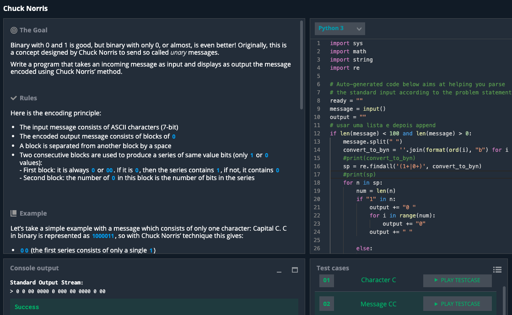

### CHUCK NORRIS
```.py
import re

# Auto-generated code below aims at helping you parse
# the standard input according to the problem statement.
ready = ""
message = input()
output = ""

if len(message) < 100 and len(message) > 0:
    message.split(" ")
    convert_to_byn = ''.join(format(ord(i), "b") for i in message)
    print(convert_to_byn)
    sp = re.findall('(1+|0+)', convert_to_byn)
    print(sp)
    for n in sp:
        num = len(n)
        if "1" in n:
            output += "0 "
            for i in range(num):
                output += "0"
            output += " "

        else:
            output += "00 "
            for i in range(num):
                output += "0"
            output += " "


d2 = output.split(" ")
#output.split(" ").remove(" ")
d3 = d2[:-1]
output1 = " ".join(d3)
print(output1)
```

https://towardsdatascience.com/hiding-data-in-an-image-image-steganography-using-python-e491b68b1372 
###covert to binary

https://stackoverflow.com/questions/38617330/split-string-into-chunks-of-same-letters 
###re.findall

