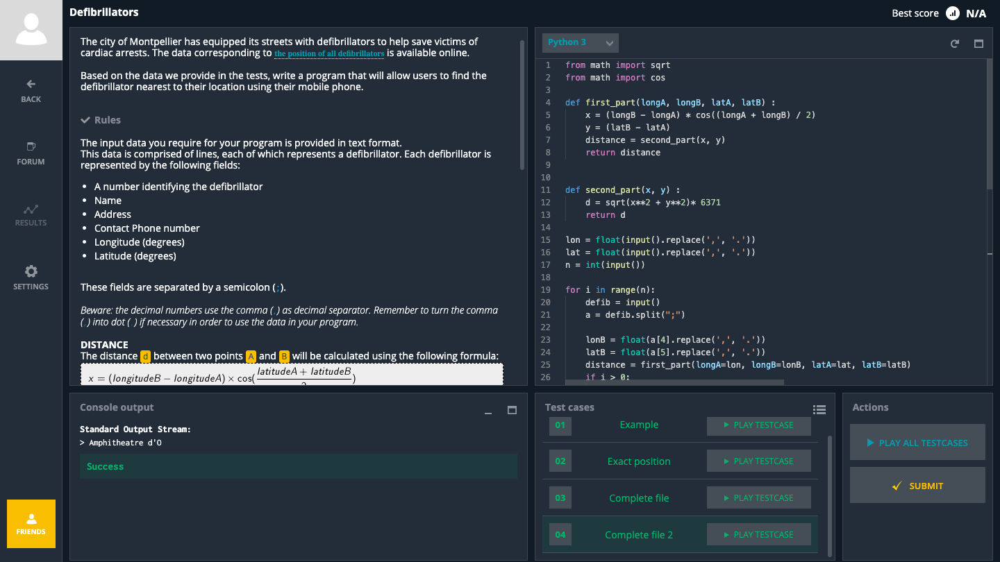

### CodingGame_Defibrillators

```.py
from math import sqrt
from math import cos

def first_part(longA, longB, latA, latB) :
    x = (longB - longA) * cos((longA + longB) / 2)
    y = (latB - latA)
    distance = second_part(x, y)
    return distance


def second_part(x, y) :
    d = sqrt(x**2 + y**2)* 6371
    return d

lon = float(input().replace(',', '.'))
lat = float(input().replace(',', '.'))
n = int(input())

for i in range(n):
    defib = input()
    a = defib.split(";")

    lonB = float(a[4].replace(',', '.'))      
    latB = float(a[5].replace(',', '.'))
    distance = first_part(longA=lon, longB=lonB, latA=lat, latB=latB)
    if i > 0:
      if distance < d1:
          ans = distance
          name = a[1]

      else :
          ans = d1
          name = nm
    else:
        ans = distance
        name = a[1]
    d1 = ans
    nm = name
print(name)
```


